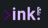

# ink! Playground

<figure>

  
  

</figure>

An ink! Playground which provides a Browser based IDE for editing Smart Contracts written in [ink!](https://github.com/paritytech/ink). A live deployment of the App can be found under [www.ink-playground.substrate.io](https://www.ink-playground.substrate.io).

Features:

- Uses the [Monaco editor](https://microsoft.github.io/monaco-editor/)
- Implements a WebAssembly version of [Rust Analyzer](https://rust-analyzer.github.io/) for code editing
- Allows saving and sharing of Smart Contract code
- Implements a one click compile functionality of ink! Smart Contracts to WASM which is provided by a backend service

## Table of Contents

<!-- AUTO-GENERATED-CONTENT:START (TOC) -->

- [Getting started](#getting-started)
- [Detailed usage instructions:](#detailed-usage-instructions)
  - [The make file and ink! playground](#the-make-file-and-ink-playground)
  - [crate-extractor](#crate-extractor)
- [Overview of the (sub-)repos](#overview-of-the-sub-repos)
  - [The contributions of `crates`](#the-contributions-of-crates)
  - [The contributions of `packages`](#the-contributions-of-packages)
- [The Dockerfiles for ink! playground](#the-dockerfiles-for-ink-playground)
<!-- AUTO-GENERATED-CONTENT:END -->

## Getting started

The ink! playground is a fronted app which is developed using TypeScript and React. It is contained in the `packages/playground` folder.

The repo contains a Rust backend which is implemented with the [actix-web](https://github.com/actix/actix-web) framework and which can be found in the 'crates/backend' folder.

The backend serves the frontend app and it also provides the backend services for compilation and Github gists creation(which we use to provide the code sharing functionality).

To clone and build the whole project on your local machine, enter:

1. `git clone clone https://github.com/paritytech/ink-playground`

2. `cd ink-playground`

3. `make install`

4. `make generate`

5. `make build`

and finally, to start the backend:

6. `make backend-run`

The last command starts the Rust webserver locally on you computer. You can then access `localhost:4000` from your browser to open the locally compiled ink! Playground open.

## Detailed usage instructions:

### The make file and ink! playground

Important commands from the make file:

- `make install` \
  Installs all the required TypeScript dependencies from all monorepo packages by using `yarn install`.
- `make generate` \
  There are parts of the Frontend which are generated by some rust crates. Namely, these are:
  - rust analyzer \
    The WebAssembly version of Rust Analyzer which is run by Frontend through some Web Workers. Generating only the rust analyzer WASM file can be done with `make generate-rust-analyzer`.
  - change.json \
    A serialized version of the CrateGraph and project source dependencies of an ink! Smart Contract. This file is provided to the WASM version of rust analyzer and is generated under `/packages/_generated/change`. Generating only the change.json file can be done with `make generate change-json`.
  - bindings \
    The actix-web Webserver backend provides some endpoints to the Frontend (`/compile`, `/test`, `/gist`). The crate `generate-bindings` from the Rust Monorepo automatically creates TypeScript types for the communication with these endpoints and provides them in `/packages/_generated/commontypes`. Generating only the bindings can be done with `make generate bindings`.
- `make build` \
  Builds the complete ink! Playground, involves:
  - frontend
    the react Frontend which needs to be provided with all three ingredients which are generated by `make generate`, as well as all npm dependencies which are installed by `make install`. Can also be build independently by `make playground-build`.
  - backend
    the actix-web backend which serves the Frontend and provides endpoint for testing, compilation and sharing of Smart Contract code. Can also be build independently by `make backend-build`.
- `make backend-run` \
  Starts a the actix web server backend and serves the release version of the playground frontend from the folder `packages/playground/dist`. Make sure to run `make build` first to build all the required Rust and frontend dependencies.
- `make playground-start` \
  Starts a dev build of the frontend repo of ink! Playground which allows for easy debugging of the Frontend code / UI, involving Rust Analyzer. Note that the compile/gist functionalities will not be available when invoking `make playground-start`
- `make docker-build` \
  Then deployment of the ink! Playground app is done in our CI by building and uploading the docker image which we generate from our [Dockerfile](./Dockerfile). Running make `docker-build` generates this docker image and tags it with `ink-playground`.
- `make docker-run` \
  Starts the Docker container of playground under the [sysbox](https://github.com/nestybox/sysbox) runtime. Make sure that you have the sysbox docker runtime installed on your computer. Instructions on how to install it can be found [here](https://github.com/nestybox/sysbox#installation).
- `make ci` \
  With `make ci`, we run the majority of tests which we execute in our Github CI.

### crate-extractor

## Overview of the (sub-)repos

We can divide this Repo into two main contributions:

- The folder `crates` is a monorepo containing the Rust source code, its separate crates serve functionalities like the web server which serves the frontend app, the backend services for Smart Contract compilation and Github Gist generation (code sharing) or the rust analyzer functionalities for the IDE.
- The folder `packages` is a TypeScript/React monorepo, containing the Frontend App which is served by the Rust backend.

### The contributions of `crates`

- #### `backend`

  This is the main crate of the web server which serves the frontend app. It is based on the [Actix Web](https://actix.rs/) framework. It serves the directory of the compiled playground app which is located in the `/packages/playground/dist` folder after executing `make build` (which involves the compilation of the production bundle of the Frontend app).

- #### `change_json`

  The IDE of the frontend app contains a WebAssembly version of [Rust Analyzer](https://rust-analyzer.github.io/). We need to provide Rust Analyzer the source code and crate graph of the analyzed smart contract. Usually, Rust Analyzer will scan the file system, load the dependency data of a rust project into an object, the `change` object and will send this object to its db. Since we can not access the file system in browser based wasm, we had to find another approach. For this we (de-)serialize the `change` object which is encoding the data. This crate contains the methods/traits to (de-)serialize the `change` object.

- #### `contract`

  This is the sample crate which serves as a blueprint for creating the serialized `change` object.

- #### `crate_extractor`

  Parses Crates and CrateGraph (the package dependency graph) of a Rust Project into a JSON file for Rust Analyzer(=RA) and provides a library for (de-)serialization of these data structures which can be referenced by a WASM implementation of RA.

  For a detailed description, refer to the corresponding section of [ARCHITECTURE.md](ARCHITECTURE.md)

  ##### Usage:

  Enter:

  `gh clone https://github.com/paritytech/ink-playground`

  `cd ink-playground`

  `cargo run -p crate-extractor -- create -i <input> -o <output>`

  Where `<input>` points to the `Cargo.toml` of the project you which to analyze and `<output>` denotes the path to the resulting '.json' file. Both are optional parameters and default to `/Cargo.toml` and `./change.json`.

- #### `generate_bindings`

  Utilizes [ts-rs](https://github.com/Aleph-Alpha/ts-rs) to auto-generate TypeScript bindings for the API endpoints that the [Actix Web](https://actix.rs/) framework of the `backend` crate provides. The bindings are generated into the `/packages/_generated/commontypes` folder, where they are consumed by the Frontend App.

- #### `rust_analyzer_wasm`

  A LSP ([Language Server Protocol](https://microsoft.github.io/language-server-protocol/)) of [Rust Analyzer](https://rust-analyzer.github.io/) for the [monaco](https://microsoft.github.io/monaco-editor/) editor which is compiled to WebAssembly and which we execute in the Browser. This crate gets compiled to the `/packages/playground/pkg` subfolder of the `playground` package. Its compiled version provides the executable WebAssembly code and the corresponding TypeScript types.

- #### `sandbox`

  Provides the sandbox environment which triggers the compilation of ink! Smart Contracts which is executed by the backend server from the `backend` crate.

### The contributions of `packages`

- #### `playground`

This is the main Frontend Webapp which provides the ink! Playground with Rust Analyzer and compilation functionalities.

- #### `ink-editor`

This isolates the components providing the monaco editor with integrated Rust Analyzer and the API endpoints for code compilation and Github gist creation into its own package.

- #### `components`

Contains the basic UI building blocks. Makes use of [PRIMEREACT](https://www.primefaces.org/primereact/) UI library.

- #### `_generated`

This is the target directory for auto generated types, files & bindings. It currently contains the `change` package which receives the `change.json` file from the `crate_extractor` crate and the `commontypes` package which carries the bindings and types which allow the Frontend (specifically the API being contained in `ink-editor` package) to communicate with the backend service for code compilation and Gist generation.

- #### `docker_tests`

Based on the jest testing framework, this packages executes some basic tests against an already running playground container (serves website, provides compile endpoint).

## The Dockerfiles for ink! playground

We have two Dockerfiles for two different docker images in this repo: `ink-playground` and `ink-backend`:

- `ink-backend`  
  Is used to compile ink! Smart Contracts in a sandboxed environment. We execute the resulting image in a sandboxed environment without network access. The image is a derived from `docker.io/paritytech/ink-ci-linux:production` and ships with a pre-compiled ink! Smart Contract.
- `ink-playground` \
  Is the main ink! Playground Dockerfile which is generated by the `./Dockerfile`. It is used to deploy the playground on our server. It is executed by using [Nestybox](https://www.nestybox.com/)'s [Sysbox](https://github.com/nestybox/sysbox) runtime. We require this runtime to compile ink! Smart Contracts through a sandboxed Docker in Docker execution within the executed Docker image by using the `ink-backend` Docker image.

  The Image is build in multiple steps by a [multi stage](https://docs.docker.com/develop/develop-images/multistage-build/) build process to improve its image size.

  For a better understanding of the steps which are involved in building this image, refer to the build dependencies section of [ARCHITECTURE.md](ARCHITECTURE.md).
