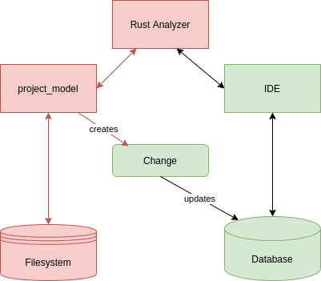
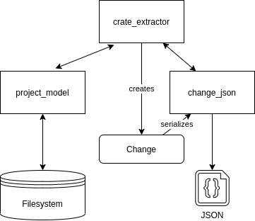
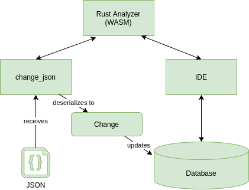

# crate-extractor

Parse Crates and CrateGraph of a Rust Project into a JSON file for Rust Analyzer

## Introduction

We want to analyze Rust projects with the Rust Analyzer IDE which we compile to Webassembly.

This CLI tool allows to extract the data of a Rust Cargo project into a .json file which can be loaded into `Rust` analyzer. This is needed since the dependencies which are usually involved when loading data into Rust analyzers database are accessing the file system and calling rustc. Those dependencies are not available for Webassembly, hence the corresponding crates won't compile to WASM.

## Usage

Enter:

`gh clone https://github.com/achimcc/crate-extractor`

`cd crate-extractor`

`cargo run create -i <input> -o <output>`

Where `<input>` points to the `Cargo.toml` of the project you wich to analyze and `<output>` denotes the path to the resulting '.json' file. Both are optional parameters and default to `/Cargo.toml` and `./change.json`.

## Description

When we use the Rust analyzer in e.g. Visual Studio code, most of its functionalities like auto completion and syntax highlightning are provided by the `IDE` crate. However, the source code of a Rust project which RA processes is collected by the `project_model` crate by scanning through the project structure on a hard drive. It gathers the required data from the hard disk of your computer and transfers it into the `Change` object. This change object is then sent to the Database and contains the precise instructions on how to update the RA database with the required project data.

This process, in a strongly simplified way, is visualized in Fig.1 below:

<figure>

  
  <figcaption>
Fig.1 The way how RA loads a  Rust project into its database
</figcaption>
  

</figure>

Here, all the crates which are colored in red won't compile to WebAssembly. This is due to the access to the local file system but also since various calls to rustc are involved and also due to many other non compatible dependencies.

However, all the tools which are provided by the IDE crate compile flawlessly as well as the RA Databse to which also the Change object berlongs, as same as all the other dependencies of these crates whcih are asbtracted away in Fig. 1.

The `crate_extractor` crate is creating the `Change` object by utilizing the `project_model` crate in a similar way then the `Rust Analyzer` crate does it in Fig 1. But then, instead of sending it to the Rust Analyzer database it utilizes the `change_json` crate to parse it to JSON. The `change_json` crate defines its own JSON structure which is (de-)serializable by [Serde JSON](https://github.com/serde-rs/json), as well as the required tools to convert the `Change` object to its corresponding JSON structure and vice-versa, see Fig. 2 below for a visualization of this interaction:

<figure>

  
  <figcaption>
Fig.2 How this repo extracts Cargo Crate data into a JSON structure
</figcaption>
  

</figure>

While the `crate_extrator` crate is utilizing various dependencies whcih won't compile to WASM, we can't use it in a Webassembly version of Rust Analyzer. However, the `change_json` crate consumes just a bare minimum of basic dependencies like the RA `Database` and therefore compiles to WASM.

The way it is utilized to provide a Rust projects source code and dependency graph to a WASM implementation of Rust Analyzer is visualized in Fig. 3 below:

<figure>

  
  <figcaption>
Fig.3 The WASM version of RA can utilize `change_json` to receive the crate deps
</figcaption>
  

</figure>
