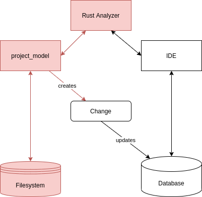
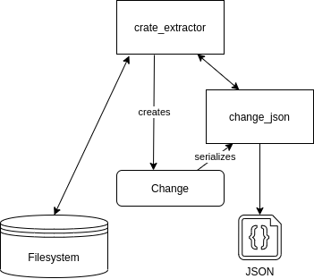
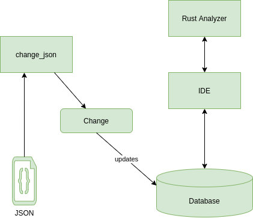

# crate-extractor
Parse Crates and CrateGraph of a Rust Project into a JSON file for Rust Analyzer

## Introduction

We want to analyze Rust projects with the Rust Analyzer IDE which we compile to Webassembly.

This CLI tool allows to extract the data of a Rust Cargo project into a .json file which can be loaded into `Rust` analyzer. This is needed since the dependencies which are usually involved when loading data into Rust analyzers database are accessing the file system and calling rustc. Those dependencies are not available for Webassembly, hence the corresponding crates won't compile to WASM.

## Usage

Enter:

``gh clone https://github.com/achimcc/crate-extractor``

``cd crate-extractor``

``cargo run create -i <input> -o <output>``

Where `<input>` points to the `Cargo.toml` of the project you wich to analyze and `<output>` denotes the path to the resulting '.json' file. Both are optional parameters and default to `/Cargo.toml` and `./change.json`.

## Description

  

  

<figure>
  
  <figcaption>Fig.1 - Trulli, Puglia, Italy</figcaption>
</figure>

